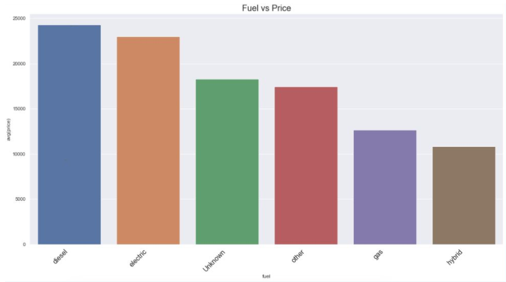
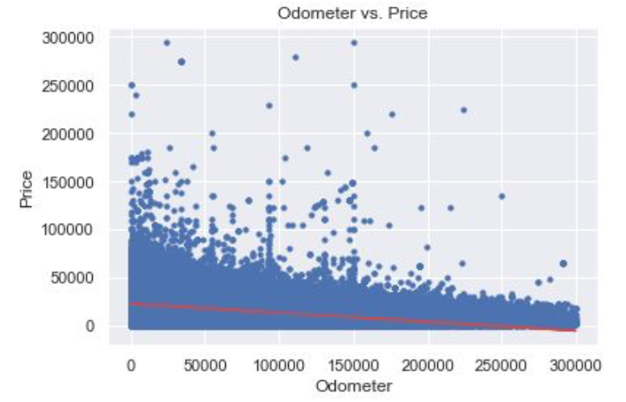
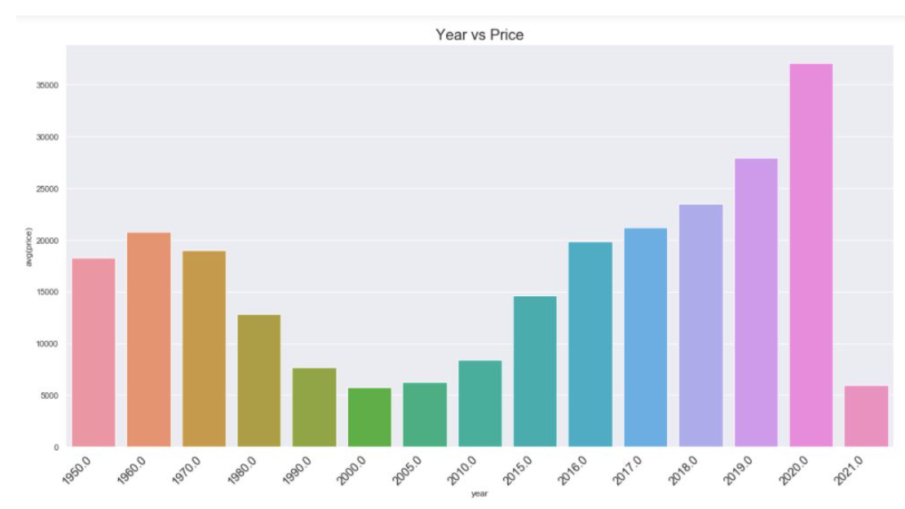

# Predicting the Price of a Used Car

## Purpose of the project: 

In this project, I created a model to predict the price of used cars based on a used cars dataset from Kaggle. I created graphs using Pandas and Seaborn to help visualize the data. The graphs were also useful in identifying the most important features in the data set. Some of the charts emphasize the most effective features while others such as mileage and age of car while other assist in visualizing the statistical testing. The features which are seen in the graphs all helped build my model and helped visualize the results. After the data was uploaded, I cleaned and organized the data so that it is useful for other people to analyze and draw their own conclusions. Below I will share a few of my graphs and then explain my final model. 

## Data Source
The dataset that I used for this project was webscraped from craigslist and taken by me from Kaggle. It originally had 435,849 rows, but was shrunken down in the data cleaning phase. 

## Graphs:
1. I graphed the fuel type against the average price for each fuel type to see which type of used car costs the most. I found that electric cars cost on average $10,000 more than gas cars. This is not surprising due to the innovation and excitement that comes along with purchasing an electric car. Furthermore, as a result of purchasing an electric car, the owner is saving thousands of dollars in gas, as well as, time because he or she no longer needs to go to the gas station to fill up his or her car. 

2. I graphed the total miles used by the car (odometer) against the price of the car to see what the effect is. I found that the more miles a car accumulated costs more than a car with fewer  miles 

3. Lastly, I plotted the age of the car against the average price of the car for that model year. As you can see, there is an inverted bell curve describing the price of cars against the year. As a car approaches the early 2000’s the car is relatively cheap, as opposed to a newer car closer to 2020 or a car that is antique from the mid 1900’s. 

## Model: 
In my model, I included all of these features and many more to predict the price of a car. For example, I included the condition of a car, the manufacturer, the state that the used car is being sold in and many more features to help my model.

## Conclusion: 
In conclusion, my model was about $7000 off from predicting the true price of a car. Further steps that I would take to improve my model would be to break up the cars into more categories such as antique and not antique. Furthermore, I would break up the feature, states, into fewer categories based off of yearly earnings. 
